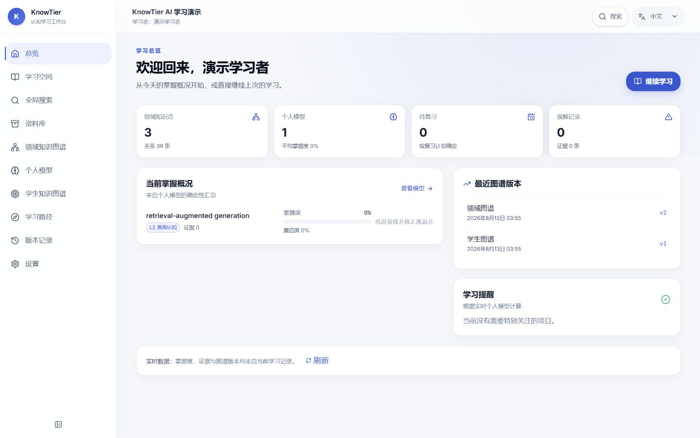
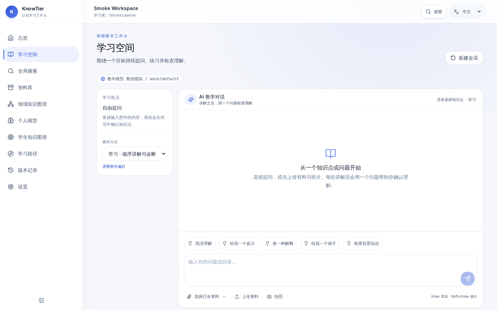
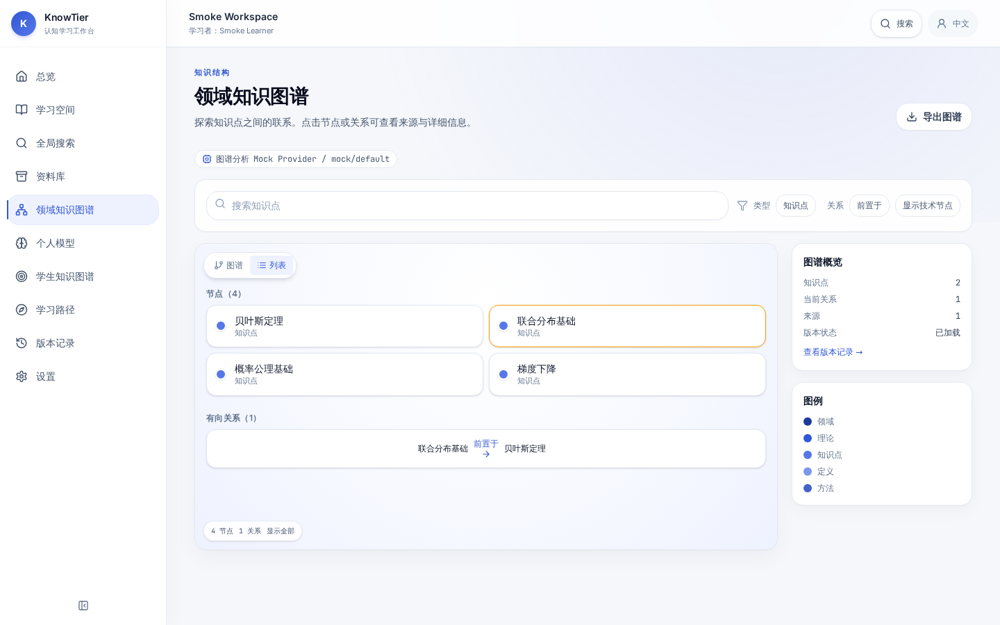
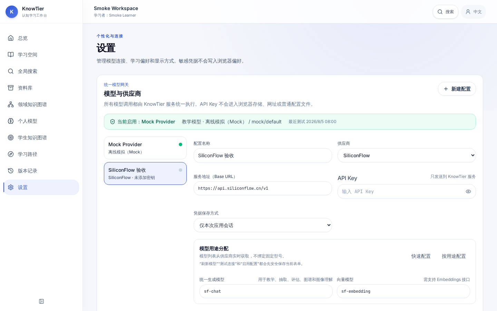

# KnowTier / Cognigraph Tutor

[](https://github.com/Yangjunjie-Lin/KnowTier/actions/workflows/ci.yml)
[](https://github.com/Yangjunjie-Lin/KnowTier/actions/workflows/frontend-ci.yml)
[](https://github.com/Yangjunjie-Lin/KnowTier/releases/latest)
[](LICENSE)

> Download the desktop app: **[latest stable release](https://github.com/Yangjunjie-Lin/KnowTier/releases/latest)**
> · [Windows installer](https://github.com/Yangjunjie-Lin/KnowTier/releases/latest/download/KnowTier-Setup-1.0.0-windows-x64.exe)
> · [Windows Portable](https://github.com/Yangjunjie-Lin/KnowTier/releases/latest/download/KnowTier-Portable-1.0.0-windows-x64.zip)
> · [中文使用说明](docs/USER_GUIDE_ZH.md)
> · [Desktop guide](docs/DESKTOP.md)

KnowTier is a full-stack tutoring workspace. Its Cognigraph backend combines a deterministic six-level
teaching policy, learner mastery estimation, source-grounded knowledge extraction, and a
versioned first-class relation graph. FastAPI exposes document, chat, graph, learner, and
export APIs. The React frontend exposes these workflows through a responsive learning UI.
PostgreSQL is the operational/audit system of record; Neo4j is the semantic projection written
through a transactional Outbox.

The default mock mode needs no model API key and performs a complete, deterministic teaching
flow suitable for local development and tests.

## Product tour

### Learning overview



### AI learning workspace



### Knowledge graph and model providers

| Source-grounded knowledge graph | Backend-only model configuration |
| --- | --- |
|  |  |

## Highlights

- Evidence-linked tutoring, six learning levels, mastery detection, misconceptions, and sources.
- Versioned domain and learner knowledge graphs with one readable relationship line per entity pair.
- Local-first desktop storage with SQLite, OS App Data persistence, and no Node/Python/Docker
  requirement for end users.
- Mock, SiliconFlow, and custom OpenAI-compatible providers behind a backend-only ModelGateway.
- Chinese and English UI, responsive desktop/tablet/mobile layouts, keyboard navigation, axe checks,
  and visual regression coverage.
- Windows, macOS, and Linux release artifacts with checksums, SBOMs, privacy notice, and explicit
  signing status.

## Desktop installation

End users do not need the development requirements below. Download the matching artifact from the
[latest release](https://github.com/Yangjunjie-Lin/KnowTier/releases/latest), verify it against
`SHA256SUMS.txt`, then follow [docs/DESKTOP.md](docs/DESKTOP.md). The application starts in offline
Mock mode; provider credentials are optional and can be session-only or stored in the OS credential
vault. Builds without a configured code-signing certificate are explicitly marked `UNSIGNED`.
Chinese users can follow the complete [中文使用说明](docs/USER_GUIDE_ZH.md).

The packaged desktop application is the one-click path for normal users: install it (or extract the
Portable ZIP on Windows), then double-click **KnowTier**. Node.js, Python, uv, Docker, PostgreSQL,
and Neo4j are not required. The published `v1.0.0` artifacts are unsigned and are never described
as signed; see the release's `SIGNING-STATUS.txt` for each platform.

## Requirements

These requirements apply only to source development and server deployment.

- Python 3.12
- [uv](https://docs.astral.sh/uv/)
- Node.js 22 and npm 10 for frontend development
- Docker Compose for the production-shaped PostgreSQL/Neo4j stack

## One-command source launch

Developers can start the complete React → FastAPI → SQLite → Mock LLM path from a clean checkout
with one command. The scripts install the committed lockfiles, migrate the local database, wait for
`/ready`, open the UI, and clean up the API process on exit:

```powershell
# Windows PowerShell
.\start.ps1
```

```bash
# macOS or Linux
./start.sh
```

The UI opens automatically at `http://127.0.0.1:5173`; open that address manually if your operating
system blocks automatic browser launch. Local data and the source-launch runtime environment are
stored under `data/local/`, separate from Docker's `.venv` mount. This launch mode intentionally
uses the credential-free Mock Provider and an isolated temporary model profile; it does not read
provider keys from the shell or `.env`. Configure a real provider from **Settings → Models &
providers** in the packaged desktop app or use the server setup below.

## Manual local setup

For a manually controlled SQLite development process, install the project and edit the copied
`.env` before initialization:

```bash
uv sync --frozen --dev --extra documents
cp .env.example .env
# Set COGNIGRAPH_DATABASE_URL=sqlite+aiosqlite:///./data/cognigraph.db
# Set COGNIGRAPH_NEO4J_REQUIRED=false and COGNIGRAPH_USE_MOCK_LLM=true
uv run cognigraph init
uv run uvicorn cognigraph.main:app --reload
```

On PowerShell, use `Copy-Item .env.example .env` in place of `cp`.

`cognigraph init` creates local storage, runs the Alembic migration against the database URL
loaded by `Settings` (including `.env`), and then registers active Prompt versions. The example
environment deliberately points at PostgreSQL, so do not run the migration from a clean checkout
until that database is running or the URL has been changed to SQLite.

To run the API process on the host while PostgreSQL and Neo4j run in Docker, use:

```bash
docker compose up -d postgres neo4j
# Set COGNIGRAPH_NEO4J_REQUIRED=true in .env
uv run cognigraph init
uv run uvicorn cognigraph.main:app --reload
```

OpenAPI is available at `http://127.0.0.1:8000/docs`. Health endpoints are `/health` and
`/ready`; readiness checks both the SQL store and the configured semantic graph repository.

In a second terminal, start the frontend development server:

```powershell
cd frontend
npm ci
npm run dev
```

Open `http://127.0.0.1:5173`. Vite proxies `/api` to the local FastAPI service, so local
development does not require permissive CORS. Frontend-specific setup and verification are
documented in [frontend/README.md](frontend/README.md).

Install the richer document stack when needed:

```bash
uv sync --dev --extra documents
uv sync --dev --extra documents --extra ocr
```

Docling is attempted first. The core install also includes real fallbacks for text, Markdown,
PDF, DOCX, and PPTX. Image ingestion uses Docling and can fall back to the pinned PaddleOCR 3.x
adapter when the `ocr` extra is installed. The extra explicitly installs the matching CPU
PaddlePaddle 3.x runtime and PyMuPDF for rendering scanned PDF pages. The adapter uses the
current `predict` API and does not silently span PaddleOCR major versions. Platform-specific
wheel availability is documented in [VISION_PIPELINE.md](VISION_PIPELINE.md).
For mixed PDFs, text-bearing pages are retained and only unresolved scanned pages are rendered
for OCR or Vision, preserving page and bounding-box provenance without reprocessing the full file.

## Docker Compose

```powershell
cp .env.example .env
docker compose up --build
```

The stack uses `pgvector/pgvector:pg16`, Neo4j 5.26 Community, a Python 3.12 uv API container,
and an Nginx-served frontend at `http://127.0.0.1:8080`. It installs the locked runtime plus the
`documents` extra, runs Alembic, and starts the API only after both databases are healthy.
Database data, uploads, the Linux virtual
environment, and the uv cache use separate named volumes, so a host Windows `.venv` is never
overwritten. Re-run `uv lock` whenever `pyproject.toml` dependencies change before starting the
frozen container install.

For OCR and scanned-PDF support, start the explicit profile instead of the lightweight API:

```bash
docker compose --profile ocr up api-ocr
```

The OCR API listens on `${API_OCR_PORT:-8001}`. The image/Vision pipeline is documented in
[VISION_PIPELINE.md](VISION_PIPELINE.md).

## First mock flow

```bash
uv run cognigraph demo
```

The demo creates a workspace and learner, extracts a source-grounded knowledge point from a
text question, teaches Level 1, records two distinct mastery evidence forms, and promotes the
learner to Level 2. It never calls the internet or a real model.

Useful CLI commands:

```bash
uv run cognigraph init
uv run cognigraph db migrate
uv run cognigraph seed-demo
uv run cognigraph workspace create --name "My workspace" --slug my-workspace
uv run cognigraph learner create --workspace <workspace-id> --name "Learner"
uv run cognigraph ingest material.pdf --workspace <workspace-id>
uv run cognigraph ask --learner <learner-id> --message "Teach me Bayes' rule"
uv run cognigraph learner show <learner-id>
uv run cognigraph graph manifest --workspace <workspace-id>
uv run cognigraph graph export --workspace <workspace-id> --format cytoscape
```

`uv run python scripts/seed_demo.py` creates reusable demo workspace and learner records in the
configured database. `uv run python scripts/demo_flow.py` instead runs the isolated in-memory
three-turn teaching demonstration. `scripts/export_graph.py` is a narrow command wrapper and
accepts the same `--workspace` and `--format` options as `cognigraph graph export`.

## Model configuration

Business code only calls the LiteLLM gateway. Each role accepts any LiteLLM model string:

```dotenv
COGNIGRAPH_USE_MOCK_LLM=false
COGNIGRAPH_TEACHER_MODEL=openai/gpt-4.1-mini
COGNIGRAPH_EXTRACTOR_MODEL=anthropic/claude-sonnet-4-20250514
COGNIGRAPH_GRADER_MODEL=gemini/gemini-2.5-flash
COGNIGRAPH_GRAPH_MODEL=openrouter/openai/gpt-4.1-mini
COGNIGRAPH_VISION_MODEL=azure/gpt-4.1
COGNIGRAPH_EMBEDDING_MODEL=openai/text-embedding-3-small
COGNIGRAPH_FALLBACK_MODELS='["ollama/qwen2.5:7b"]'
COGNIGRAPH_TOOL_CALLING_ENABLED=true
COGNIGRAPH_MAX_TOOL_STEPS=4
COGNIGRAPH_MAX_TOOL_RESULT_BYTES=30000
COGNIGRAPH_TOOL_TIMEOUT_SECONDS=10
COGNIGRAPH_MAX_CONTEXT_TOKENS=4000
COGNIGRAPH_MAX_RECENT_TURNS=6
COGNIGRAPH_MAX_GRAPH_DEPTH=3
COGNIGRAPH_MAX_GRAPH_NODES=100
COGNIGRAPH_GRAPH_MODEL_ENABLED=true
COGNIGRAPH_VISION_ENABLED=true
COGNIGRAPH_VISION_FALLBACK_ENABLED=true
OPENAI_API_KEY=<provider-key>
```

The four context/graph budget variables above are the canonical names. The
older `COGNIGRAPH_CONTEXT_TOKEN_BUDGET`, `COGNIGRAPH_RECENT_TURN_LIMIT`,
`COGNIGRAPH_GRAPH_MAX_DEPTH`, and `COGNIGRAPH_GRAPH_MAX_NODES` names remain
accepted as migration aliases.

`COGNIGRAPH_API_KEY` is passed to LiteLLM as an explicit key and is convenient when all configured
roles share one credential. For mixed providers or separate credentials, use the provider-specific
environment variables recognized by LiteLLM, such as `OPENAI_API_KEY`, `ANTHROPIC_API_KEY`, or the
corresponding Azure/Bedrock variables. Application secret settings use `SecretStr`, are excluded
from model representations, and are never placed in prompts or logs.
The Compose services forward the configured role-model names plus common OpenAI, Anthropic,
Gemini, OpenRouter, Azure, and AWS/Bedrock credential variables from `.env`; unset provider
variables remain empty and are not required in mock mode.

## API outline

- `POST /v1/workspaces`
- `POST /v1/learners`
- `POST /v1/workspaces/{workspace_id}/documents`
- `POST /v1/documents/{document_id}/ingest`
- `POST /v1/chat`
- `GET /v1/graph/manifest`, `/subgraph`, `/nodes/{id}`, `/assertions/{id}`
- `GET /v1/graph/revisions`, `/revisions/{id}`, `/export`
- `GET /v1/learners/{id}/model`, `/model.csv`, `/knowledge-graph`, `/learning-path`, `/evidence`
- `GET /v1/learners/{id}/graph/revisions`, `/graph/assertions/{assertion_id}`, `/graph/nodes/{node_id}`

Every graph edge exposed to Cytoscape carries its first-class `assertion_id`, relation type,
description, confidence, and source count. Node and assertion detail endpoints return source
spans and graph revision identity.

In development, a workspace ID may be supplied in the request body/query as before. In
production, the authenticated gateway must inject `X-Workspace-ID` on every tenant-scoped
request; the API rejects requests without it and does not trust a client-provided tenant header.
Workspace provisioning is a separate bootstrap operation and requires
`COGNIGRAPH_WORKSPACE_PROVISIONING_TOKEN` plus `X-Workspace-Provisioning-Token`.

## Verification

The frontend uses the committed lockfile and Node.js 22. Run the same static,
unit, production-build, and browser Contract Test sequence used by CI:

```bash
cd frontend
npm ci
npm run typecheck
npm run lint
npm run test
npm run build
npx playwright install --with-deps chromium
npm run e2e
```

`npm run e2e` keeps the browser API Contract Test isolated by intercepting
`/api/v1` requests. The separate full-stack suite uses real services and the
credential-free Mock LLM through the Nginx `/api` proxy:

```bash
docker compose -f docker-compose.e2e.yml config --quiet
docker compose -f docker-compose.e2e.yml up --detach --build --wait --wait-timeout 1200
cd frontend
npm ci
npx playwright install --with-deps chromium
npx playwright test --config=playwright.full-stack.config.ts
cd ..
docker compose -f docker-compose.e2e.yml down --volumes --remove-orphans
```

The full-stack browser test creates an isolated Workspace and learner, uploads
and ingests TXT, teaches with `COGNIGRAPH_USE_MOCK_LLM=true`, reads both graphs,
the personal model, and both version histories, then restarts FastAPI and
verifies the persisted state again. Its default frontend URL is
`http://127.0.0.1:18080`; the E2E host ports can be overridden with the
`E2E_*_PORT` variables when they conflict locally.
If `E2E_FRONTEND_PORT` is changed, set `COGNIGRAPH_E2E_FRONTEND_URL` to the
matching `http://127.0.0.1:<port>` value before starting Playwright.

Validate the production Compose manifest independently with:

```bash
docker compose config --quiet
```

Backend verification remains independent of the frontend jobs:

```bash
uv lock --check
uv sync --frozen --dev --extra documents
uv run ruff format --check src tests scripts
uv run ruff check src tests scripts
uv run mypy src/cognigraph
uv run pytest

# Opt-in production-sized synthetic budget checks
COGNIGRAPH_RUN_PERFORMANCE=1 uv run pytest tests/performance -m performance

# Opt-in live PostgreSQL + pgvector + Neo4j smoke flow
COGNIGRAPH_RUN_PRODUCTION_E2E=1 uv run pytest tests/e2e -m "postgres and neo4j"

# Opt-in live PostgreSQL + pgvector boundary checks (after migrations)
COGNIGRAPH_RUN_POSTGRES_TESTS=1 uv run pytest tests/integration/test_postgres_production.py -m postgres

# Opt-in real OCR acceptance (use the OCR profile or uv --extra ocr)
COGNIGRAPH_RUN_OCR_TESTS=1 uv run pytest tests/integration/test_ocr_live.py -m ocr

# Opt-in paid/provider-backed model smoke
COGNIGRAPH_RUN_LIVE_MODEL=1 COGNIGRAPH_LIVE_MODEL_API_KEY=<provider-key> \
  uv run pytest tests/integration/test_live_model.py -m live_model
```

On PowerShell, set each environment variable with `$env:NAME="1"` before running the command.
Live Neo4j, OCR, production E2E, performance, and paid-model tests are opt-in and remain skipped
unless their explicit environment is configured. The default unit, contract, repository, API,
and PDF tests are offline.

GitHub Actions separates these boundaries: `ci.yml` validates Docker Compose and runs frozen
lock/static/default offline backend checks; `frontend-ci.yml` runs the complete Node.js 22
frontend sequence plus both the API Contract Test and the real PostgreSQL/Neo4j/Mock-LLM browser
flow; `integration.yml` provisions PostgreSQL 16 with pgvector and Neo4j 5.26 and exercises the
production workflow; and `release-check.yml` starts the production-shaped Compose stack, runs the
production-size synthetic budget suite, and runs the OCR acceptance job. Failed browser runs retain
Playwright traces, screenshots, video, Compose service status, and container logs as workflow
artifacts. The live-model job is present but executes only when the `COGNIGRAPH_API_KEY` repository
secret is configured. OCR is mandatory for published releases and opt-in through `run_ocr` for a
manual release-check dispatch.

See [ARCHITECTURE.md](ARCHITECTURE.md), [DATA_MODEL.md](DATA_MODEL.md),
[PROMPTS.md](PROMPTS.md), [TOOL_CALLING.md](TOOL_CALLING.md),
[VISION_PIPELINE.md](VISION_PIPELINE.md), [LEARNER_GRAPH.md](LEARNER_GRAPH.md),
[MIGRATION_GUIDE.md](MIGRATION_GUIDE.md), and [PRODUCTION_TESTING.md](PRODUCTION_TESTING.md)
for implementation details.

Community and project policies: [Contributing](CONTRIBUTING.md), [Security](SECURITY.md),
[Support](SUPPORT.md), [Code of Conduct](CODE_OF_CONDUCT.md), [Privacy](PRIVACY.md), and
[License](LICENSE).

## Known limits

Tool calls, graph-model comparison, OCR, and Vision are bounded optional steps. A provider without
tool support falls back to the pre-fetched Context Bundle. OCR remains an explicit optional
runtime because PaddlePaddle wheels are platform-specific and substantially increase image size;
the OCR lock resolution and Compose profile are complete when that path is enabled. Production
PostgreSQL/Neo4j and paid-model smoke tests run only in environments that provide those services
and credentials.
